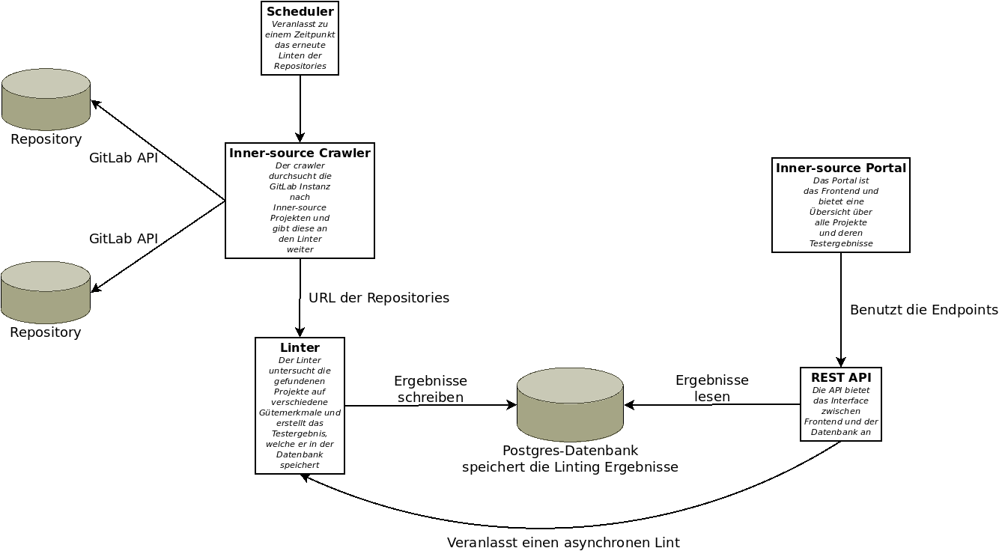
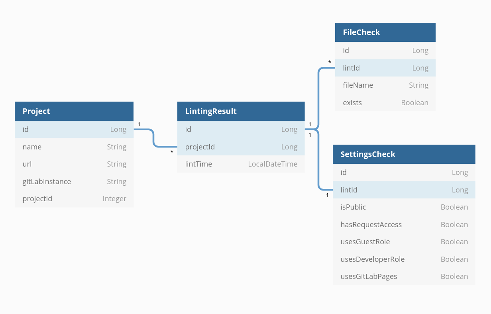

## Softwarearchitektur

Die Full-Stack Architektur der Software ist implementiert durch:

- Spring Boot im Backend
- Angular im Frontend
- PostgreSQL als Datenbank
- Als Docker-Images gepackt
- Und mittels Docker-Compose orchestriert/ausgeführt

# Datenbankschema

