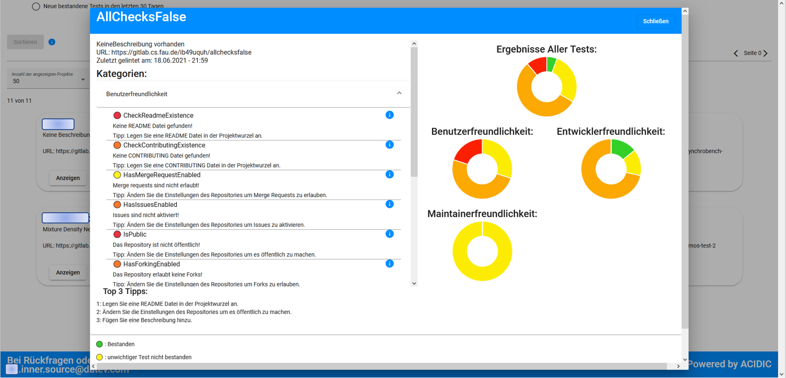

Willkommen bei Inner-Source Project Linter!
Die Applikation ermöglicht es Nutzern, verschiedene Inner Source Repositories anzeigen und vergleichen zu lassen. Somit kann analysiert werden, ob es möglich ist, die Qualität des Projekts zu verbessern.

## Startseite

Auf der Startseite werden alle analysierten Repositories angezeigt. In der oberen Suchleisten kann man nach Repository suchen und diese werden unterhalb der Tableiste angezeigt. Ebenso ist es möglich nach bestimmten Kategorien sowie anderen Kriterien zu sortieren.

## Ergebnisse ansehen

Wenn man auf den Knopf "Anzeigen" eines bestimmten Repository klickt, öffnet sich ein Dialog auf dem folgende Informationen angezeigt werden:

Zur linken hat man die einzelnen Checks die nach den Tags sortiert sind, dafür muss man den entsprechenden Tag anklicken. Zusätzlich dazu gibt es eine kurze Beschreibung des Checks und falls dieser nicht erfolgreich war eine Fehlermeldung und ein Hinweis wie man den Fehler möglicherweise beheben könnte.  
Auf der rechten Seite sieht man Doughnutcharts die die gesamten Checkergebnisse des Repository abbilden und die Checkergebnisse sortiert nach dem jeweiligen Tag.

Unten im Dialog werden drei Tipps angezeigt, die Verbesserungen vorschlagen basierend auf fehlgeschlagene Tests mit hoher Priorität.

## Statistiken ansehen

Im Tab Statistiken kann man zum einem alle Ergebnisse als .csv downloaden, sowie die Entwicklung der Repositories über die Zeit betrachten.

