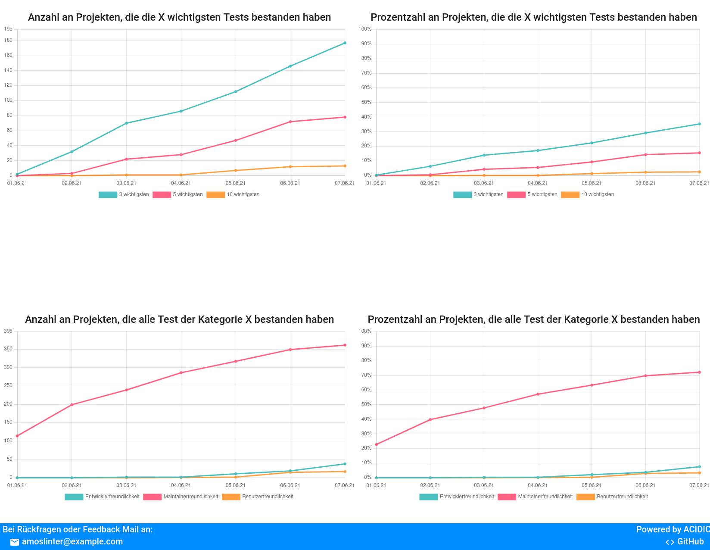
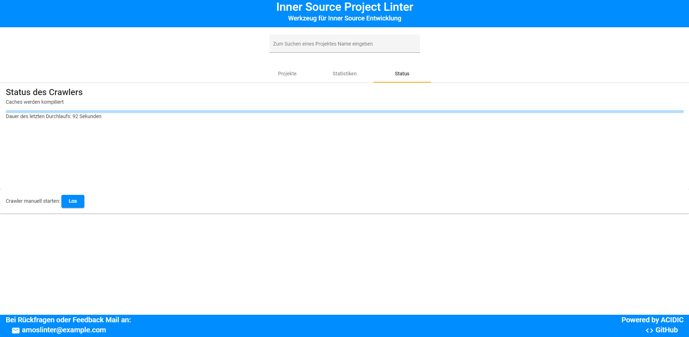

# Nutzung

**Willkommen bei Inner-Source Project Linter!
Die Applikation ermöglicht es Nutzern, verschiedene Inner Source Repositories anzeigen und vergleichen zu lassen. Somit kann analysiert werden, ob es möglich ist, die Qualität des Projekts zu verbessern.**

## Startseite

Auf der Startseite werden alle analysierten Repositories angezeigt.

1.  Hier ist es möglich, die unten angezeigten Repositories, nach Namen oder dem Namespace/Autor zu Filtern.
2.  Reitermenü
    - Projekte: zeigt die Projekte und Informationen dazu.
    - Statistiken: zeigt Statistiken zu den Projekten und ermöglicht es die Ergebnisse als csv zu exportieren
    - Status: zeigt den Status des Crawlers und ermöglicht es ihn manuell zu starten.
3.  Einstellungen für die Sortierung der unten angezeigten Projekte.
4.  Änderung der Anzeige wie viele Projekte pro Seite angezeigt werden und wechseln der Seiten.
5.  Kurze Übersicht zu den Projekten und die Möglichkeit Details zum Projekt anzeigen zu lassen. Um zum Projekt zu kommen, klicken Sie auf das Code-Zeichen in der rechten oberen Ecke. 

## Ergebnisse ansehen

Wenn man auf den Knopf "Anzeigen" eines bestimmten Repository klickt, öffnet sich ein Dialog auf dem folgende Informationen angezeigt werden:

1. Aus-/Einklappbare Reiter für die Tests, sortiert nach der Rubrik.
2. Ergebnisse der Spezifischen Tests.
   - Grüne Tests sind bestanden und benötigen keine weitere Arbeit.
   - Gelb, Orange, Rot sind nicht bestandene Tests und sollten bearbeitet werden. Hier wird direkt angezeigt wie der Fehler behoben werden kann.
3. Der Info-Button zeigt an, was genau bei dem Test überprüft wird.
4. Ein Donut-Graph für eine schnellübersicht wie viele Tests dieses Projekt in der jeweilgen Kategorie bestanden hat.
5. Tipps für das Projekt wie man am besten das Repo verbessert.
6. Meta Informationen zu dem Projekt. 

## Statistiken ansehen

In diesem Tab kann man sich verschiedene Statistiken ansehen.
Aktuelle Statistiken sind die Anzahl an Projekten die X wichtige tests bestanden haben und die alle Tests einer Kategorie bestanden haben.
Die ergebnisse sind in der Anzahl und in Prozent anzeigbar.

Am Ende der Seite haben Sie die Möglichkeit, die Daten als CSV zu exportieren um selber statistische Auswertungen durchzuführen.

## Crawler Status

Hier wird der Status des Crawlers angezeigt.
Zum einen wird der aktuelle Arbeitsschritt angezeigt, darunter befindet sich ein Fortschrittsbalken und wie lange der letzte Dirchlauf gebraucht hat.

Am unteren Ende kann man dann noch den Crawler mit dem "Los"-Button manuell starten.

